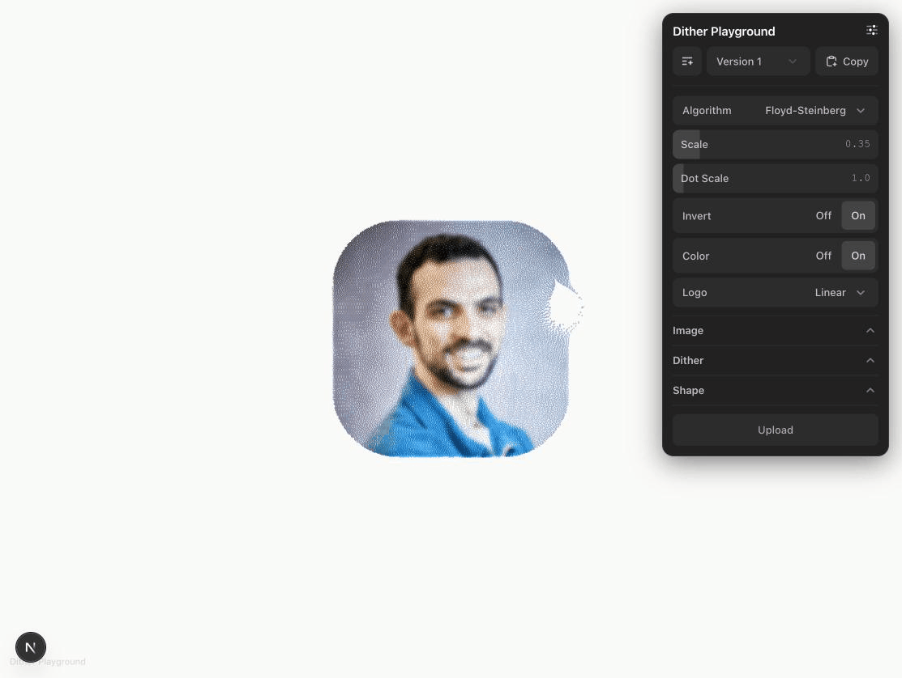

# Dither Playground

A fork of the original [Dither Playground](https://github.com/emilkowalski/dither) by [Emil Kowalski](https://x.com/emilkowalski_), adding color support, idle animation, and other enhancements.



## What's new in this fork

- **Color mode** -- particles retain their original image colors instead of rendering as monochrome gray
- **Idle orbit animation** -- a subtle simulated mouse orbits the image edge when no interaction is detected, hinting that the image is interactive
- **Increased particle density** -- higher resolution grid for sharper detail
- **Decoupled density inversion** -- inverted particle density (dark areas = more particles) works independently of color/background settings

## Running locally

```bash
npm install
npm run dev
```

Opens at [localhost:3000](http://localhost:3000).

## Stack

Next.js 15 &middot; React 19 &middot; Tailwind CSS v4 &middot; Motion &middot; DialKit

## Credits

Forked from the dithered particle effect [Emil Kowalski](https://x.com/emilkowalski_) built for [linear.app/next](https://linear.app/next). See his [original tweet](https://x.com/emilkowalski/status/2036778116748542220).

## License

[MIT](LICENSE)
